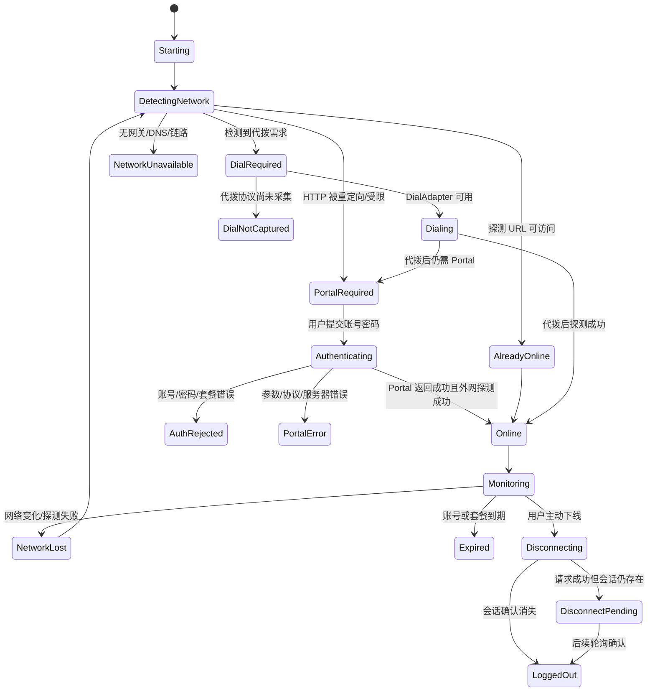
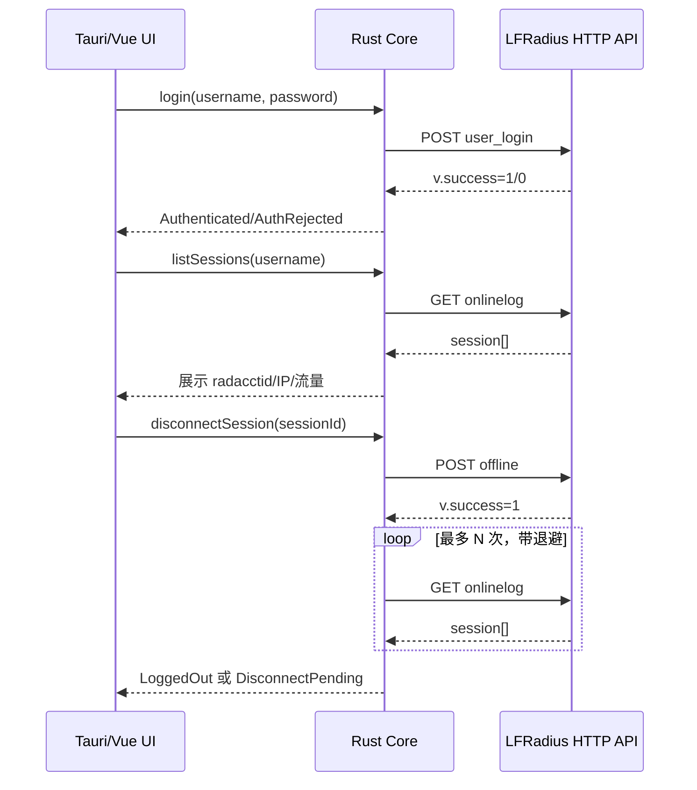
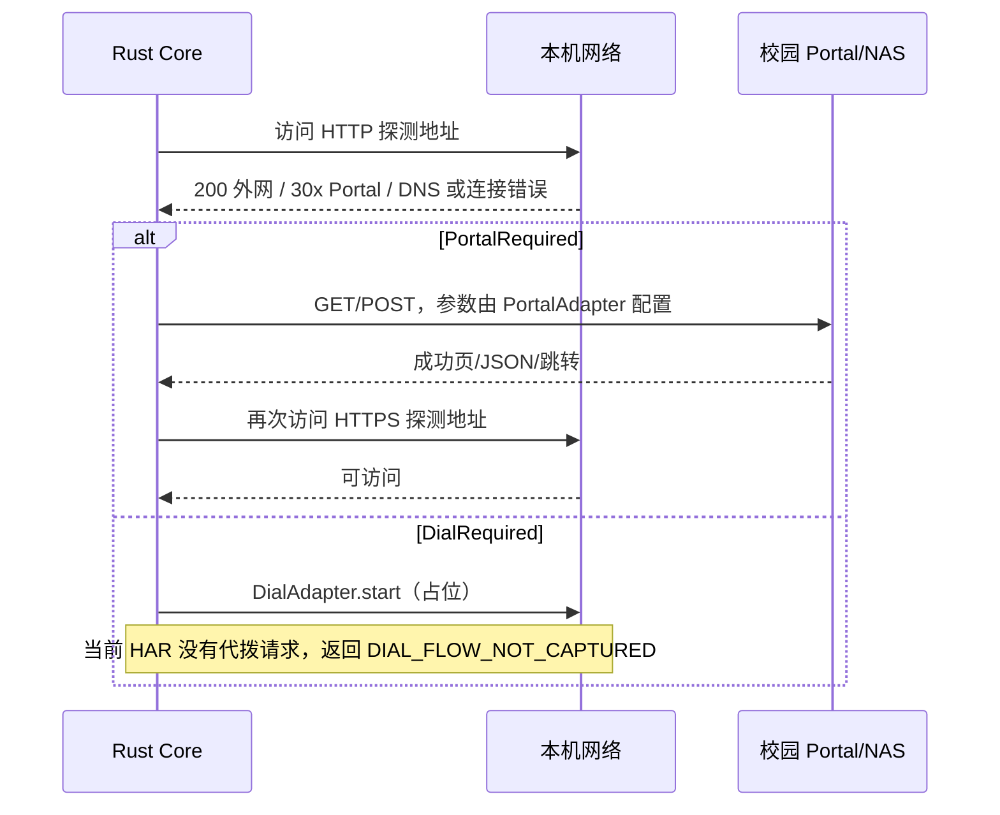

# 校园网认证协议与实现

本文合并了脱敏 HAR 的协议解析与客户端程序设计：前半部分解析协议，后半部分说明代码如何解决这些问题。

来源文件：

- `校园网.har`：LFRadius 用户后台登录、在线会话查询、按 `radacctid` 踢下线。
- `172.18.100.65.har`、`172.18.100.65（2）.har`：CMCC Portal 认证与代拨流程。

## 一、LFRadius 用户后台接口

### 结论

HAR 确实包含了：

1. 用户认证系统页面加载；
2. 用户登录接口成功；
3. 查询当前在线会话；
4. 对指定在线会话执行下线；
5. 下线后再次查询在线会话，在线会话数减少。

它**没有包含完整的“重新通过校园网 Portal 认证上线”过程**。下线之后只看到访问学校官网资源，没有发现新的 Portal 跳转、认证表单提交、认证成功回调、RADIUS Access-Request 或代拨接口请求。因此，代拨流程目前应保留为未采集分支，不能从这份 HAR 直接实现。

### 请求时间线与接口含义

HAR 共 163 条请求，其中大量是前端静态 JS/CSS、图片和学校官网资源。与认证流程直接相关的请求如下：

| 顺序 | 方法 | 脱敏 URL | 结果 | 判断 |
|---:|---|---|---|---|
| 0 | GET | `/lfradius/web/admin/login` | 200 | 打开认证系统登录页 |
| 41 | POST | `/lfradius/home.php?c=user&a=user_login` | 200，JSON `v.success=1` | 用户名/密码登录成功 |
| 45–47 | GET | `/lfradius/home.php?c=user&a=header_info`、`address_and_phone`、`myinfo` | 200 | 加载用户资料、套餐、到期时间 |
| 93–96 | GET | `header_info`、`address_and_phone`、`person`、`realname_show` | 200 | 打开个人信息页，读取在线操作所需资料 |
| 97–105 | GET | `/lfradius/home.php?c=user&a=onlinelog&page=1&pagesize=15` | 200 | 轮询在线会话，开始时返回 2 条活动会话 |
| 106 | POST | `/lfradius/home.php?c=user&a=offline&r=person` | 200，JSON `v.success=1` | 对指定 `radacctid` 执行下线 |
| 107–109 | GET | `onlinelog?page=1&pagesize=15` | 200 | 下线后只剩 1 条活动会话 |
| 110 | GET | `https://学校官网/?rand=随机值` | 200 | 下线之后访问学校官网；没有看到 Portal 认证请求 |

静态资源和官网图片请求不属于认证协议，应从实现和测试夹具中排除。

### 登录接口

请求：

```http
POST /lfradius/home.php?c=user&a=user_login HTTP/1.1
Host: <认证服务器>
Content-Type: application/x-www-form-urlencoded
Origin: http://<认证服务器>
Referer: http://<认证服务器>/lfradius/web/admin/login

username=<账号>&password=<密码>
```

响应结构：

```json
{
  "v": {"success": 1, "msg": "", "url": "", "wait_time": 0},
  "d": []
}
```

观察：

- HAR 中没有记录 Cookie，也没有看到显式 `Authorization` 请求头。
- 这不代表一定没有会话：认证可能依赖浏览器未被 HAR 导出的存储、IP/网关上下文、服务端其他机制，或者 WebInspector 的导出策略没有保存相关字段。
- 不能只凭 HAR 复刻登录；需要用浏览器 DevTools 的“Copy as cURL”或在测试环境再次抓一条请求，确认 Cookie、Local Storage、CSRF、Referer 和实际认证凭证。
- 登录请求使用 HTTP 明文。生产客户端不能照搬，必须优先使用 HTTPS；如果学校设备只能提供 HTTP，应在产品中明确风险并限制到受信任的校园网地址。

### 在线会话查询

请求：

```http
GET /lfradius/home.php?c=user&a=onlinelog&page=1&pagesize=15 HTTP/1.1
```

响应中的会话字段包括：

```json
{
  "radacctid": "<会话记录 ID>",
  "username": "<账号>",
  "acctstarttime": "<开始时间>",
  "acctsessiontime": "<已用秒数>",
  "framedipaddress": "<用户 IP>",
  "acctinputoctets": "<入站字节数>",
  "acctoutputoctets": "<出站字节数>"
}
```

接口返回还带有：

```json
{"total": 2, "where": "where username='<账号>' and acctstoptime is null"}
```

实现含义：

- 当前“在线”是服务端 `radacct` 活动记录的视图，不是本机网卡是否有流量。
- `acctstoptime is null` 表明会话仍被系统认为活动。
- `radacctid` 是下线操作的关键标识，不能只用账号下线，否则多设备共享账号时可能踢错会话。
- 页面会重复轮询该接口；客户端可采用短轮询，但要增加退避、网络变化监听和最大轮询时长。

### 踢下线接口

请求：

```http
POST /lfradius/home.php?c=user&a=offline&r=person HTTP/1.1
Host: <认证服务器>
Content-Type: application/x-www-form-urlencoded
Origin: http://<认证服务器>
Referer: http://<认证服务器>/lfradius/web/home/person

radacctid=<会话记录 ID>&username=<账号>&acctstarttime=<开始时间>&acctsessiontime=<秒数>&framedipaddress=<用户 IP>&acctinputoctets=<入站字节数>&acctoutputoctets=<出站字节数>&key=<会话记录 ID>&num=1
```

响应：

```json
{"v":{"success":1,"msg":"","url":"","wait_time":0},"d":[]}
```

验证信号：

- 下线前 `onlinelog` 返回 2 条活动会话。
- 下线请求返回成功。
- 下线后 `onlinelog` 返回 1 条活动会话，且被指定的那条记录消失。

这说明后台接口至少触发了计费系统的会话下线/踢线逻辑。它没有证明“客户端已经从 NAS 断开”，除非能在 NAS、RADIUS Accounting 或实际网络流量侧进一步验证。

### “重新上线”目前缺失的证据

下线后的请求没有出现下列任何一种信号：

- Portal 302 跳转或登录页面；
- `/lfradius/libs/portal/...`、`portal.php`、`/nasid/...` 等 Portal URL；
- 认证提交字段，例如 `username`、`password`、`usrmac`、`usrip`、`source-ip` 的组合提交；
- CMCC Portal 1.0/2.0 的认证回调；
- RADIUS Access-Request/Access-Accept（HTTP HAR 本身也通常看不到 UDP RADIUS）；
- 认证成功后的页面或状态接口；
- 代拨/PPPOE 的启动、停止、重拨、回流或上报请求。

最后访问学校官网只能说明浏览器发起了 HTTPS 请求，不能证明该账号完成了重新认证。可能的解释包括：

1. 设备被踢后网络尚未真正断开，旧会话或另一条在线会话仍然可用；
2. NAS 的踢线/COA 是异步的，HAR 在 Portal 弹出前结束；
3. 浏览器没有重新发起被劫持的 HTTP 探测请求；
4. 学校使用的是系统级代拨或 PPPOE，浏览器 HAR 看不到代拨过程；
5. 代拨窗口没有完成，或者代拨配置尚未生效。

## 二、CMCC Portal 认证与代拨

### 结论

两份文件不是两个完全独立的最小流程：第二份包含第一份账号的 Portal 片段，随后还包含后台登录、踢线和第二个账号的再次 Portal 登录。

两个账号的 Portal 行为不同：

| 流程 | 结果 |
|---|---|
| 第一个账号 | CMCC Portal 认证成功后直接返回 `/login/success/`，没有代拨轮询 |
| 第二个账号 | CMCC Portal 认证成功后，`/login/success/` 返回 302 到 `__coa_search_page/`；页面显示 `[代拨]`，轮询 `__coa_search/` 返回 `success` 后才进入最终成功页 |

因此代拨是“认证成功后的异步等待”，是否进入代拨分支由服务端/NAS 状态决定。客户端不应该根据账号、套餐名或固定等待时间猜测，而应该跟随 HTTP 响应判断。

### 第一个账号：普通 Portal 流程

第一份 HAR 共 7 条请求，核心流程如下：

```text
POST /lfradius/libs/portal/unify/portal.php/login/cmcc_login/
  usrname, passwd, treaty=on
  nasid, usrmac, usrip, basip
  success, fail, offline=1
  portal_version=1, portal_papchap=pap
       ↓
POST /lfradius/libs/portal/unify/portal.php/login/cmcc_login/
  cmcc_login_value=<服务端生成的隐藏值>
       ↓
POST /lfradius/libs/portal/unify/portal.php/login/cmcc_login_result/
  l=<服务端生成的隐藏值>
  响应：success
       ↓
GET /lfradius/libs/portal/unify/portal.php/login/success/
  HTTP 200
  页面显示：登录成功
```

第一份 HAR 的时间从开始提交到成功页约 1.3 秒。第二次 POST 不是客户端重新构造的业务参数，而是第一步响应返回 HTML 中的隐藏表单自动提交：

```html
<form method="post" action=".../cmcc_login/">
  <input name="cmcc_login_value" type="hidden" value="..." />
</form>
<script>document.forms['login'].submit()</script>
```

`cmcc_login_result` 的 `l` 字段同样是服务端生成的状态载荷。客户端应把它当作不透明值透传，不能自行生成或把解码后的内容写入日志。

### 第二个账号：含代拨流程

第二份 HAR 后半段从一次系统探测开始：

```http
GET /lfradius/libs/portal/unify/portal.php/login/main/nasid/4/
    ?wlanuserip=<用户IP>
    &clientip=<用户IP>
    &wlanacname=route1
    &clientmac=<用户MAC>
    &paip=<NAS/Portal地址>
    &vlan=0.0
    &iarmdst=captive.apple.com/hotspot-detect.html
```

这几个字段的含义可以按当前设备解释为：

| 字段 | 作用 |
|---|---|
| `nasid/4` | LFRadius 中配置的 NAS ID |
| `wlanuserip` / `clientip` | 终端在校园网中的 IP |
| `wlanacname` | 接入设备标识，抓包中为 `route1` |
| `clientmac` | 终端 MAC |
| `paip` | 接入设备或 Portal 侧地址 |
| `vlan` | VLAN 上报值 |
| `iarmdst` | 被劫持的探测目标，抓包中是 Apple Captive Network Assistant 地址 |

随后提交的表单和普通流程相同，仍然是 Portal 1.0 + PAP：

```text
POST /login/cmcc_login/
POST /login/cmcc_login/              # cmcc_login_value 自动提交
POST /login/cmcc_login_result/       # l 不透明载荷，返回 success
```

差异出现在下一步：

```http
GET /lfradius/libs/portal/unify/portal.php/login/success/
HTTP/1.1 302 Found
Location: /lfradius/libs/portal/unify/portal.php/login/__coa_search_page/
```

`__coa_search_page/` 返回一个等待页面，正文明确包含 `[代拨]`。页面内 JavaScript 的逻辑是：

```text
初始倒计时约 20 秒
每 3 秒 POST /login/__coa_search/
不带业务表单参数
响应正文严格等于 success 时停止轮询
跳转 /login/success/success/1
其他非空响应显示为状态文本
```

抓包中的实际代拨轮询：

```http
GET  /lfradius/libs/portal/unify/portal.php/login/__coa_search_page/
POST /lfradius/libs/portal/unify/portal.php/login/__coa_search/
     响应正文：success
GET  /lfradius/libs/portal/unify/portal.php/login/success/success/1
     页面显示：登录成功
```

当前抓包只记录到一次 `__coa_search`，约 3 秒后返回 `success`。因此不能把 3 秒硬编码为代拨完成时间；正确实现是最多轮询 20 秒，收到精确的 `success` 立即完成，超时返回代拨超时。

### 两个账号的后台会话背景

第二份 HAR 在第二次 Portal 登录之前还操作了 LFRadius 用户后台：

1. 后台用户登录成功。
2. `onlinelog` 返回两个活动会话。
3. 对其中一条 `radacctid` 调用 `POST /home.php?c=user&a=offline&r=person`。
4. 再次查询后目标会话消失，另一条旧会话仍存在。
5. 随后发生新的 Portal 探测和第二个账号登录。

这说明测试环境中可能同时存在旧会话。实现“仅一次会话”时，不能按用户名直接踢线，必须记录登录前的会话集合，登录后只选择新增的 `radacctid`；如果不能唯一确定，就拒绝自动踢线。

### 客户端应如何实现

#### Portal 参数模型

```rust
struct CmccContext {
    nas_id: String,
    user_mac: String,
    user_ip: String,
    nas_ip: String,
    access_name: Option<String>,
    vlan: Option<String>,
    original_probe_url: Option<String>,
    portal_version: u8, // 当前抓包为 1
    auth_mode: AuthMode, // 当前抓包为 PAP
}
```

#### 提交策略

- 第一步由 Portal 页面提供 `usrname`、`passwd` 和上下文参数。
- 第一步响应中的 `cmcc_login_value` 由客户端作为隐藏表单值自动提交。
- 后续 `l` 由页面脚本或客户端保存为短期内存值。
- 所有临时载荷只存在于本次流程内，不写入配置和普通日志。
- 账号、密码、MAC、IP 和 opaque token 不要放入诊断日志。

#### 成功分支

```text
cmcc_login_result == success
  ↓
GET /login/success/
  ├─ HTTP 200 + “登录成功”
  │    → 普通上线完成
  └─ HTTP 302 Location=.../__coa_search_page/
       → 进入代拨轮询
```

#### 代拨状态机

```text
PortalAuthenticating
  -> PortalAccepted
  -> Dialing
  -> PollingDialStatus
  -> Online                 # __coa_search 返回 success
  -> DialFailed             # fail/错误文本/超时
```

建议错误码：

```text
PORTAL_AUTH_REJECTED
PORTAL_RESULT_INVALID
DIAL_POLL_TIMEOUT
DIAL_POLL_REJECTED
DIAL_FLOW_NOT_CAPTURED
```

## 三、重要安全事项

原始 HAR 中包含明文密码和个人信息，登录请求使用 HTTP。应立即修改该测试账号的密码，把原始 HAR 移出共享目录并不提交 Git，后续只使用脱敏副本。

两份 HAR 的 Portal 表单同样是 HTTP，且 Portal 页面会把账号、密码和设备网络参数放入 HTML、隐藏字段或短期载荷。生产客户端应：

- 优先使用 HTTPS；若校园网只能提供 HTTP，要把风险明确显示给用户。
- 不在 URL、日志、崩溃报告或配置文件中保存密码和 opaque token。
- 不把 `cmcc_login_value` 或 `l` 解码后打印出来。
- 只在内存中保存本次会话；启用“仅一次会话”时，下线确认后清除账号、密码、临时载荷和会话缓存。
- 对 `nasid`、Portal 主机和原始跳转地址做白名单校验，禁止前端拼接任意内网请求。

## 四、总体状态机



## 五、登录、踢线、重新上线流程

### 5.0 本机网络上下文

认证前端现在从用户选择的本机网卡读取当前 IPv4 和 MAC。Rust 的
`portal_core::network` 使用跨平台接口枚举，在 macOS、Linux、Windows 上提供统一的
网卡列表；GUI 在设置中显示网卡、IPv4 和 MAC，CLI 可以用 `interfaces` 查看列表并用
`--interface <名称>` 固定接口。程序不会读取网卡流量计数，流量仍来自后台
`onlinelog`。

对于 CMCC Portal，程序会将 Portal 入口 URL 的 `wlanuserip`、`clientip`、`clientmac`
替换为所选网卡当前值，并将 `paip` 固定为 `172.18.100.65`。认证页返回的隐藏
`basip` 保持服务端值，不用本机 IP 或 `paip` 覆盖。

留空 Portal URL 时，客户端默认先按 DGCU 的 `main/nasid/4/` CMCC 模板构造入口，
再读取表单；模板失败后才按“认证失败后自动探测”设置回退到公共 HTTP 探测地址。

### 5.1 已确认的后台会话流程



### 5.2 重新上线流程（当前只定义接口，不假设细节）



## 六、Rust 后端实现

### 6.1 推荐目录

```text
src-tauri/src/
├── main.rs
├── app_state.rs
├── commands.rs              # Tauri command 边界
├── config.rs                # 版本化配置
├── error.rs                 # 稳定错误码
├── network/
│   ├── mod.rs
│   ├── interfaces.rs        # 网卡、网关、MAC、IP
│   ├── captive.rs           # Portal 探测
│   └── monitor.rs           # 网络变化/休眠恢复
├── portal/
│   ├── mod.rs
│   ├── adapter.rs           # PortalAdapter trait
│   ├── lfradius.rs          # LFRadius 用户接口
│   ├── cmcc.rs              # CMCC Portal 参数映射
│   └── vendor.rs            # 厂商差异
├── session/
│   ├── mod.rs
│   ├── state_machine.rs
│   └── polling.rs
├── credentials.rs           # 系统钥匙串
├── dial/
│   ├── mod.rs
│   └── placeholder.rs       # 代拨占位
└── diagnostics.rs           # 脱敏日志
```

### 6.2 核心类型

```rust
#[derive(Clone, Debug, serde::Serialize)]
pub enum AuthState {
    Starting,
    DetectingNetwork,
    PortalRequired,
    Authenticating,
    Online,
    Monitoring,
    Disconnecting,
    LoggedOut,
    DisconnectPending,
    DialRequired,
    DialNotCaptured,
    NetworkUnavailable,
    AuthRejected,
    PortalError,
}

#[derive(Clone, Debug, serde::Serialize)]
pub struct OnlineSession {
    pub radacctid: String,
    pub username: String,
    pub acct_start_time: String,
    pub session_seconds: u64,
    pub framed_ip: Option<std::net::IpAddr>,
    pub input_octets: u64,
    pub output_octets: u64,
}

#[derive(Clone, Debug, serde::Serialize)]
pub struct ApiEnvelope<T> {
    pub v: ApiStatus,
    pub d: T,
}

#[derive(Clone, Debug, serde::Serialize, serde::Deserialize)]
pub struct ApiStatus {
    pub success: i32,
    pub msg: String,
    pub url: String,
    pub wait_time: u64,
}
```

### 6.3 Portal 适配器

```rust
#[async_trait::async_trait]
pub trait PortalAdapter: Send + Sync {
    async fn detect(&self) -> Result<PortalContext, AppError>;
    async fn authenticate(
        &self,
        ctx: &PortalContext,
        credential: &Credential,
    ) -> Result<AuthResult, AppError>;
    async fn logout(&self, ctx: &PortalContext) -> Result<(), AppError>;
}
```

`LfradiusAdapter` 负责：

1. 构造 `/home.php?c=user&a=user_login`。
2. 使用 `application/x-www-form-urlencoded` 编码账号密码。
3. 解析 `v.success`、`v.msg`、`v.wait_time`。
4. 将服务端错误映射为稳定错误码。
5. 登录成功后执行真实外网探测。

`CmccPortalAdapter` 和厂商 API 适配器负责：

1. 解析 `usrmac`、`usrip`、`source-ip`、`nasid` 等参数。
2. 按配置选择 GET、POST form 或 POST JSON。
3. 限制重定向次数和允许域名/IP。
4. 处理成功页、JSON 和失败页。
5. 永远不把完整密码写入 URL 或日志。

### 6.4 在线会话服务

流量数据只从 LFRadius `onlinelog` 返回的 `acctinputoctets`、`acctoutputoctets` 读取。客户端不读取操作系统网卡统计；“速率”仅在两次后台累计值发生变化时按时间差推算，否则显示“等待后台计费更新”。

```rust
pub async fn disconnect_and_confirm(
    client: &reqwest::Client,
    base_url: &url::Url,
    session: &OnlineSession,
) -> Result<(), AppError> {
    let form = [
        ("radacctid", session.radacctid.clone()),
        ("username", session.username.clone()),
        ("acctstarttime", session.acct_start_time.clone()),
        ("acctsessiontime", session.session_seconds.to_string()),
        ("framedipaddress", session.framed_ip.map(|x| x.to_string()).unwrap_or_default()),
        ("acctinputoctets", session.input_octets.to_string()),
        ("acctoutputoctets", session.output_octets.to_string()),
        ("key", session.radacctid.clone()),
        ("num", "1".to_string()),
    ];

    let response = client
        .post(base_url.join("home.php?c=user&a=offline&r=person")?)
        .form(&form)
        .send()
        .await?;

    let result: ApiEnvelope<Vec<serde_json::Value>> = response.json().await?;
    if result.v.success != 1 {
        return Err(AppError::RemoteRejected(result.v.msg));
    }

    confirm_session_absent(client, base_url, &session.radacctid).await
}
```

`confirm_session_absent` 应使用 1 秒、2 秒、4 秒等退避，设置最大等待时间。超过最大等待时间返回 `DISCONNECT_PENDING`，不要伪造成功。

## 七、Tauri 前端命令

建议只暴露以下命令：

```text
get_network_state()
detect_portal()
login(username, remember_account)
list_online_sessions()
disconnect_session(session_id)
logout()
get_auth_state()
save_settings(settings)
delete_saved_credential()
get_diagnostics()
```

前端状态：

```text
network: offline | captive | online | unknown
session: none | authenticating | online | disconnecting | pending
portal: unknown | lfradius | cmcc | vendor_api
last_error: stable error code + safe message
```

实现要求：

- 密码只在 `login` 调用期间存在于内存对象中。
- 记住密码使用系统钥匙串，默认关闭。
- 前端不允许直接发任意 HTTP 请求。
- 前端显示会话 ID 时只显示末尾少量字符。
- IP、MAC、账号和访问地址在诊断导出中默认掩码。

## 八、代拨占位实现

Portal 认证成功后如果服务端返回 `__coa_search_page/`，说明进入代拨分支；除状态轮询外，代拨的启动、停止与凭据仍没有采集到真实请求，因此先使用明确的未采集结果：

```rust
pub trait DialAdapter {
    async fn detect(&self) -> Result<DialContext, AppError>;
    async fn start(&self, ctx: &DialContext, credential: &Credential)
        -> Result<DialSession, AppError>;
    async fn stop(&self, session: &DialSession) -> Result<(), AppError>;
    async fn status(&self, session: &DialSession) -> Result<DialStatus, AppError>;
}
```

第一版 `PlaceholderDialAdapter` 行为：

```text
detect() -> DialRequired 或 NotRequired
start()  -> DIAL_FLOW_NOT_CAPTURED
stop()   -> 无操作并返回 NotSupported
status() -> Unknown
```

预留字段：

```text
DialMode = None | PPPOE | VendorApi | SystemClient | Unknown
DialEndpoint = 可选地址
DialUsername = 账号（不得写入普通日志）
DialState = NotDetected | Required | Starting | Online | Failed
DialSessionId = 可选
DialErrorCode = 可选
```

在采集到真实代拨控制请求之前，`start` 一律返回 `DIAL_FLOW_NOT_CAPTURED`；不要根据“踢下线之后访问官网”推断代拨已完成。

## 九、验收标准

- 能检测当前是离线、Portal 受限还是已在线。
- 登录错误时显示安全、可读的错误原因。
- 能列出当前账号的多个在线会话。
- 只能踢掉用户选中的 `radacctid`。
- 踢线后能验证目标会话确实消失；异步未完成时显示 Pending。
- 重新上线必须通过实际外网探测确认。
- 代拨未采集时显示“暂未支持/尚未采集”，不显示虚假成功。
- 三平台均能安装、登录、退出、恢复网络和删除凭据。
- 日志中搜索不到明文密码、Cookie、token、RADIUS 密钥和完整身份证号。

